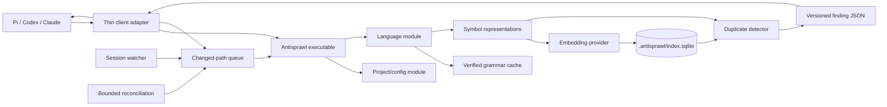

# Antisprawl Architecture

> **Status:** Accepted design; issues #15 through #18 are implemented
>
> **Target release:** `0.1.0`
>
> **License:** Apache-2.0

## 1. Purpose

Antisprawl runs reproducible checks after coding-agent edits and surfaces evidence of likely duplicate implementations. It helps an agent discover existing code before adding another utility, helper, or near-copy.

Antisprawl is advisory. It does not prove semantic equivalence, automatically refactor code, or guarantee good architecture.

### Goals

- Detect renamed and near-miss duplication in named functions and methods.
- Prefer precise, actionable findings over broad, noisy recall.
- Check changes incrementally during Pi, Codex CLI, and Claude Code sessions.
- Support multiple source languages without coupling the detector to one syntax tree.
- Support structural-only and configurable remote or local embedding providers.
- Produce the same structural result for the same source, configuration, grammar, and Antisprawl version.
- Fail open when parsing, indexing, watching, storage, or embedding is unavailable.

### Non-goals for v1

- General abstraction-quality or architecture judgment.
- Complexity or erosion enforcement.
- Automatic refactoring.
- Blocking edits or CI.
- Cross-repository indexing.
- Parsing embedded languages inside a host file.
- Approximate nearest-neighbor indexes.
- A public programmatic SDK.
- An MCP server.
- Telemetry.

Cross-language discovery is an opt-in experiment within one project, not part of the primary duplicate detector.

### Current implementation boundary

Issues #15 through #18 implement the public `index` and `check` commands: Project discovery, embedded verified TypeScript parsing, source-free Structural representations, the SQLite Index, Findings for Symbols changed in the current Edit batch, resumable embedding batches, and exact semantic search with a native sqlite-vec path and application fallback. Projects can explicitly select the fixed `openai` or experimental `openai-codex` provider; omission remains Structural-only. `index --dry-run` previews local work without credentials, Source egress, or Index mutation. The deterministic provider remains private to acceptance tests, and Findings are never persisted. Generic providers, grammar downloads, watchers, harness adapters, other languages, and release packaging remain later work. Sections describing those capabilities are target architecture, not claims about the current executable.

## 2. Terms

| Term                       | Meaning                                                                                                                           |
| -------------------------- | --------------------------------------------------------------------------------------------------------------------------------- |
| **Project**                | The nearest ancestor directory containing one of the supported Antisprawl configuration files.                                    |
| **Symbol**                 | A named function, method, or named closure/arrow function extracted from a supported grammar.                                     |
| **Probable duplicate**     | A same-language, meaningful-size symbol pair whose semantic and structural evidence passes configured gates.                      |
| **Related implementation** | An opt-in, lower-confidence cross-language match that may reveal duplicated responsibility but cannot usually be reused directly. |
| **Embedding identity**     | The provider, model, dimensions, language, and representation version that determine whether a stored vector can be reused.       |
| **Profile**                | An Embedding identity plus the detector version and thresholds used to interpret embedding similarity.                            |
| **Coverage**               | Whether every eligible source file and, under an active Profile, its required vectors are current in the Index.                   |

## 3. System context



The executable is the only execution interface. Pi, Codex, Claude, skills, and shell hooks do not import Antisprawl internals; they spawn the executable and translate its versioned JSON result.

## 4. External interfaces

### 4.1 Project layout

```text
.antisprawl/
├── config.jsonc      # preferred committed JSONC policy
└── index.sqlite      # disposable, ignored Index
```

A command searches ancestor directories nearest-first. In the first directory containing configuration, precedence is `.antisprawl/config.jsonc`, `.antisprawl/config.json`, `.antisprawl.jsonc`, then `.antisprawl.json`. Only the winner is loaded; same-directory alternatives produce warnings and parent Project configurations are not merged. Source paths remain relative to this root, and discovery rejects lexical or symlink escapes.

The future `init` command will add `.antisprawl/index.sqlite*` to the applicable ignore file with confirmation. Git is optional: when available it can accelerate later file discovery and reconciliation; issue #15 uses configured globs and content hashes.

### 4.2 Public CLI

| Command                                 | Purpose                                                                                                                    |
| --------------------------------------- | -------------------------------------------------------------------------------------------------------------------------- |
| `antisprawl init`                       | Create project configuration, configure a provider or structural-only mode, and establish ignore rules.                    |
| `antisprawl index`                      | Build, resume, reconcile, or replace the project index.                                                                    |
| `antisprawl index --dry-run`            | Preview local indexing work without reading credentials, calling a provider, or mutating the Index.                        |
| `antisprawl index --update-grammars`    | Explicitly resolve newer grammar/query pins before indexing.                                                               |
| `antisprawl check [paths...]`           | Update and check named paths; with no paths, reconcile the project.                                                        |
| `antisprawl status [--probe]`           | Report configuration, coverage, grammars, provider, integrations, and recent failures. `--probe` may contact the provider. |
| `antisprawl ignore <id> [--reason ...]` | Add a committed pair-level suppression.                                                                                    |
| `antisprawl ignore --list`              | List suppressions.                                                                                                         |
| `antisprawl ignore --remove <id>`       | Remove a suppression.                                                                                                      |
| `antisprawl report [--json]`            | Produce a local operational report without source or vectors.                                                              |

Harness protocol commands are internal and are not part of the documented user interface.

Machine-readable output is versioned JSON on stdout. Human diagnostics go to stderr. Findings are advisory and therefore exit `0`; malformed invocation, invalid configuration, or failure of an explicitly requested operation exits nonzero. Hook adapters translate failures into each harness protocol and fail open.

There is no public library interface in v1. The CLI JSON protocol is the external seam.

### 4.3 Configuration

The selected configuration file accepts JSONC comments and trailing commas regardless of its `.json` or `.jsonc` suffix. `$schema` is optional. The future `init` command writes `version: 1`; a missing version means v1 with a warning, while an unsupported future version is an error. Omitted `embedding` selects Structural-only mode. Issues #15 through #17 reject explicitly configured providers; issue #18 adds the fixed, calibrated `openai` and experimental `openai-codex` Profiles. Custom models, dimensions, semantic thresholds, and detection settings remain rejected until broader calibration supports them.

Unknown keys produce warnings and are preserved. Wrong value types and contradictory settings are errors. CLI mutations use targeted JSONC edits so comments, formatting, ordering, and unknown keys survive.

Illustrative shape:

```jsonc
{
  "version": 1,
  // "$schema" is optional.
  "embedding": {
    "provider": "openai-codex",
  },
  "sources": {
    "include": ["**/*"],
    "exclude": [],
  },
  "detection": {
    "relatedImplementations": false,
    "maxFindingsPerBatch": 3,
    // minimumTokens and thresholds may override shipped defaults.
  },
  "grammars": {
    // Machine-maintained exact parser/query revisions and asset digests.
  },
  "suppressions": [],
}
```

Issue #18 provider configuration names only `openai` or `openai-codex`; each resolves to its selected fixed Profile. Later generic provider work may add model, base-URL, dimension, and environment-variable settings. API keys and sensitive header values never belong in configuration.

### 4.4 Finding contract

A finding contains:

- protocol version and finding ID;
- finding type;
- Edited and Candidate symbol names, Project-relative paths, and source ranges;
- language and embedding-profile provenance;
- separate structural and semantic evidence values;
- calibration state when semantic thresholds are custom or unverified;
- concise guidance to inspect whether responsibilities actually match.

The finding does not assert that reuse is mandatory. The agent may reuse the existing symbol, generalize an appropriate shared abstraction, keep an intentional duplicate, or suppress the pair with a reason.

Finding IDs hash the finding type, language, and the two Project-relative path plus qualified-symbol-name identities in canonical sorted order. Current Edited and Candidate roles do not affect the ID. A suppression therefore survives edits to the same named pair; moving or renaming a Symbol causes reevaluation.

`check` returns Findings only for Eligible Symbols that are new or whose comment-free strict token hash changed in the current Edit batch. An unchanged rerun returns no Findings. Findings and delivery history are not stored: the Agent session retains previously delivered advice, and the stable ID lets it recognize a pair reported after a later edit. Future harness adapters may inject at most three Findings from an Edit batch; Probable duplicates rank ahead of Related implementations, and at most one experimental Related implementation may be injected.

## 5. Modules and seams

Antisprawl uses a few deep modules rather than exposing each implementation detail as an interface.

### Project module

Owns root discovery, JSONC configuration, source inclusion, ignore semantics, path normalization, and configuration invalidation. Callers provide a working directory and receive one validated project description.

### Change-discovery module

Owns session leases, filesystem watching, debouncing, changed-path queuing, and bounded reconciliation. Its output is a set of content-hash-qualified paths; callers do not reason about watcher events.

### Language module

Owns grammar discovery, verified installation, CST parsing, symbol extraction, and primary-language selection. Its adapters normalize grammar-specific captures into one symbol record. Multiple grammar adapters justify this seam.

### Representation module

Converts a symbol into the strict token stream, normalized structural stream, q-gram fingerprints, hashes, and embedding input required by the detector. It is the single source of truth for what a representation version means.

### Embedding module

Owns explicit provider batch limits, input estimation, retries, deadlines, cancellation, credentials, vector dimensions, and content-hash caching. Each bounded chunk calls an internal provider adapter; Antisprawl does not rely on an SDK's implicit batching. The private `codex-auth.ts` submodule contains the experimental file-backed OAuth details but remains part of this boundary. OpenAI-compatible providers remain later work. Structural-only mode does not instantiate an embedding adapter.

### Index module

Owns SQLite schema, transactions, provenance, file and symbol replacement, vector persistence, exact candidate queries, partial progress, and atomic rebuilds. It uses the Effect Bun SQLite adapter for ordinary persistence and Effect Schema at persisted-data boundaries. A private read-only `bun:sqlite` connection is isolated to verified sqlite-vec loading, probing, and candidate queries; fallback remains behind the same Index boundary. Storage access remains localized, but v1 does not publish a storage plug-in interface while only one implementation exists.

### Detection module

Owns meaningful-size filtering, candidate retrieval, deterministic structural corroboration, threshold gates, stable ranking, and finding construction. It returns evidence, not refactoring decisions.

### Harness adapters

Translate native session and hook events into CLI invocations, then translate finding JSON into model-visible context. Adapters contain no parsing, indexing, scoring rules, or Effect runtime. They remain minimal native host scripts.

## 6. Effect v4 beta runtime

Effect v4 beta is a required runtime foundation, not an incidental dependency. The repository records Bun `1.4.2` in `devEngines.packageManager`; source execution and compilation reject a different Bun runtime. Effect owns CLI orchestration, configuration decoding, filesystem and database operations in issue #15, with later runtime responsibilities added only by their implementation tickets. Parsing and representation remain ordinary TypeScript.

Every directly declared Effect-family package is pinned exactly to `4.0.0-beta.107`, and the lockfile fixes the transitive graph:

| Package                  | Role                                                               |
| ------------------------ | ------------------------------------------------------------------ |
| `effect`                 | Core effects, Schema, Layers, scopes, and schedules.               |
| `@effect/platform-bun`   | Bun platform services and `BunRuntime.runMain`.                    |
| `@effect/sql-sqlite-bun` | Effect SQL adapter over `bun:sqlite`, including extension loading. |

One `BunRuntime.runMain` entrypoint composes the process Layers. Scopes and finalizers own resources such as SQLite connections, watcher fibers, and signal-driven shutdown. `Schedule`, timeouts, and scoped fibers express retry, deadline, parallelism, and interruption policies instead of custom Promise or `AbortController` machinery.

Effect `Schema` decodes untrusted configuration, CLI protocol data, provider responses, and persisted provenance. Effectful module interfaces return `Effect` with tagged expected errors. Pure modules accept already-decoded values and do not acquire services or add Effect wrappers.

Unstable Effect CLI and SQL imports stay inside the executable and Index module respectively. Provider HTTP remains inside the Embedding boundary, including its private Codex-auth submodule. These implementation types do not cross the external CLI JSON seam or leak into pure detector modules.

Effect's structured logging and metrics feed the approved local diagnostics and bounded counters. No telemetry exporter is configured by default.

Effect-family upgrades are atomic changes that run the full verification suite. Antisprawl `0.1.0` may ship on a verified beta and does not wait for Effect v4 stable.

## 7. Language and grammar architecture

Tree-sitter provides incremental concrete syntax trees, not a language-independent semantic model. Every supported language therefore needs a verified symbol query that maps grammar-specific nodes into the common symbol record.

Issue #15 verifies TypeScript `.ts`, `.mts`, and `.cts` sources, including their declaration variants. TSX, JavaScript, and other target languages remain deferred. A language is supported only when its parser asset, compatible Symbol query, extraction fixtures, and detector fixtures pass acceptance tests. Unknown or ambiguous languages are skipped visibly rather than guessed.

The initial TypeScript bootstrap embeds the official `tree-sitter-typescript` v0.23.2 WASM, the pinned Symbol query, and a provenance manifest in both source and compiled execution. Size and SHA-256 are verified before load, ABI compatibility is checked, and the Language module consumes one resolved `{ bytes, query, provenance }` value. This embedded path supersedes lazy installation for the issue #15 TypeScript slice without constraining the later design: a verified downloader/cache can provide that same resolved value when grammar updates are implemented.

The target architecture uses the Neovim Tree-sitter registry for future language discovery instead of maintaining a competing catalog. Existing pins never follow `latest`; updates will require the later `antisprawl index --update-grammars` command. Future cache writes must remain verified and atomic because parser WASM is executable input.

Future `index` and `check` commands may invoke the lazy installer. A hook that cannot finish installation within its deadline will fail open; explicit indexing can complete it later.

Only a file's primary language is parsed in v1. Configured path-glob overrides resolve ambiguous extensions. Embedded regions such as JavaScript inside HTML are deferred. Symbols containing Tree-sitter `ERROR` or `MISSING` nodes are skipped, counted in `status`, and retried when their file changes.

Eligible symbols are named functions, methods, and named closures/arrow functions. Enclosing class or module names are metadata, not independently embedded symbols. Whole classes, modules, arbitrary top-level chunks, and anonymous fragments are excluded. If one file contains multiple Eligible Symbols with the same qualified name, detection excludes that ambiguous identity with a warning rather than inventing an unstable public identity.

## 8. Representations and detection

### 8.1 Meaningful-size gate

Small getters, wrappers, and validators often become indistinguishable after identifier and literal normalization, yet sharing them would create a worse abstraction. Antisprawl therefore extracts supported symbols but does not embed, compare, or report symbols below `minimumTokens`.

The count uses comment-free canonical tokens so it is deterministic across supported languages. Structural policy version 1 uses a 20-body-token minimum for the frozen issue #16 cases. Broader calibration may justify a later version; lowering the threshold requires explicit indexing of newly eligible Symbols, while raising it only filters existing records.

### 8.2 Two representations

Each eligible symbol produces:

1. **Embedding input:** language, signature, and comment-free body, preserving identifiers and literals except that representation version 2 replaces the declared Symbol's own name with `$identifier`.
2. **Structural input:** strict role-aware tokens plus a canonical stream that normalizes local identifiers and literals by category.

The index stores vectors, hashes, token/q-gram fingerprints, metadata, and source ranges. It does not retain raw bodies or embedding inputs.

### 8.3 Detection cascade

For a changed-symbol batch:

1. Parse and represent every eligible changed symbol.
2. Retrieve same-language candidates through embeddings, or through deterministic structural search in structural-only mode.
3. Compare strict and normalized hashes as evidence.
4. Compute exact q-gram overlap and bounded ordered-token overlap.
5. Apply separate meaningful-size, structural, and semantic gates.
6. Rank deterministically and construct findings.

Strict hash equality is evidence rather than an automatic advisory. Under Structural policy version 1, equality of the role-aware normalized hash passes the Structural gate; otherwise both the q-gram and ordered-token thresholds must pass. Embedding-enabled near misses must also pass their configured semantic gate. Antisprawl does not collapse evidence into an opaque aggregate score.

Same-language probable duplicates target Type-2 and near-miss Type-3 clones: substantially the same logic with renamed identifiers, changed literals, or small edits. Trivial boilerplate and merely related implementations are excluded.

Cross-language `related_implementation` retrieval is opt-in, embedding-led, lower confidence, restricted to the current project, and unable to displace probable duplicates. It is explicitly experimental.

Threshold defaults are versioned by provider, model, dimensions, language, and detector version. Custom or untested profiles are marked uncalibrated. Semantic findings from such profiles require explicit custom thresholds. Structural findings remain available independently.

Structural results are reproducible from pinned inputs. Remote providers may change a model behind a stable name, so semantic results are reproducible within the persisted vector cache but are not promised to be byte-identical after a clean remote-provider rebuild.

## 9. Embedding providers

V1 targets explicit Structural-only operation, OpenAI API-key embeddings, an experimental `openai-codex` adapter, and later generic OpenAI-compatible endpoints. There is no implicit provider or authentication fallback.

Issue #18 adds two fixed providers behind the same internal seam. Both use Bun's built-in `fetch`, explicit batches of two, a 30-second deadline, non-negative integer response indices and usage, ordered response validation, and aggregate usage/latency reporting against `https://api.openai.com/v1/embeddings`. They do not retry transport failures, rate limits, or server errors.

### OpenAI API-key adapter

`openai` reads `OPENAI_API_KEY` from the process environment and never persists it. Its fixed `text-embedding-3-small` Profile uses 384 dimensions, the lowest dimension that passes the live 384/1536 acceptance matrix at the versioned semantic threshold.

### Experimental Codex OAuth adapter

`openai-codex` uses the user's existing file-backed Codex login:

- resolve `$CODEX_HOME/auth.json`, using `~/.codex/auth.json` only when `CODEX_HOME` is unset or empty;
- require file-backed ChatGPT/Codex authentication with non-empty access and supplied refresh tokens;
- require a standard three-part access-token JWT with a finite, non-negative expiry, without locally verifying its signature;
- send the access token as a bearer token to the embeddings endpoint;
- use JWT expiry only to schedule refresh within five minutes of expiry;
- lock and re-read the auth file before refresh, prepare the replacement, then compare the exact on-disk bytes immediately before persistence;
- preserve and adopt different usable credentials observed by that final comparison, or fail without mutation when only other bytes changed;
- preserve unknown fields and atomically persist successful token rotation; the filesystem has no atomic compare-and-replace operation, so a Codex write after the final comparison can still race with the rename;
- retry the embeddings request exactly once after a successful refresh from `401`;
- never log or expose tokens; and
- leave the auth file byte-for-byte unchanged when refresh fails.

This OAuth route is not guaranteed by OpenAI's public API contract. It remains experimental and intended for personal development. Keyring-only credentials are unsupported until a documented bridge exists. Its fixed `text-embedding-3-small` Profile independently selects 384 dimensions through the same live 384/1536 matrix.

An explicit remote `antisprawl index` is Source-egress consent and establishes the completed Profile required for later incremental work. No prompt or `--yes` is required. `check` never starts a missing, full, or changed-Profile backfill. `index --dry-run` reads no credentials, makes no provider call, and does not mutate the Index. Hooks never initiate remote backfills.

## 10. Persistence and vector search

The disposable project index lives at `.antisprawl/index.sqlite`. It stores:

- schema and representation provenance;
- project and coverage state;
- files, content hashes, languages, and parse status;
- symbol identities, qualified names, ranges, token counts, and fingerprints;
- embedding profile metadata and vector BLOBs;
- durable changed-path queue and watcher leases; and
- aggregate operational counters and bounded sanitized recent failures.

It does not store Findings, Finding evidence, Finding outcomes, or delivery history.

It stores no source, prompts, commands, transcripts, or credentials.

The Index uses one canonical ordinary float32 vector BLOB representation for both search paths. On Linux x64, the executable embeds pinned `asg017/sqlite-vec` v0.1.9, verifies it, atomically extracts it to a private versioned cache, loads it on the query connection, and probes its version and cosine function. sqlite-vec orders candidates by exact cosine over the ordinary BLOB table; application full-precision cosine rescoring remains authoritative for gates, public evidence, and ranking. Digest, extraction, load, or probe failure emits one bounded diagnostic and uses application exact search over the same BLOBs without reindexing or changing Coverage.

Quantized search requires recall benchmarks before enablement. ANN indexes are a v1 non-goal. LanceDB, USearch, and alternate storage engines are deferred until measured scale requires them.

An interrupted full index commits completed provider batches and aggregate usage, exits `130`, and resumes only missing Embedding-input hashes. Coverage remains partial until an explicit `index` completes it. No `check` invocation backfills unrelated missing vectors or a missing, changed, or incomplete Profile; it uses Structural-only analysis and directs the user to `index`. With a matching completed Profile, `check` may embed only changed eligible Symbols.

A configuration or schema incompatibility never triggers a surprise rebuild from a hook. The Index becomes stale, and one diagnostic per session asks for an explicit `antisprawl index`. Structural replacement remains atomic. Semantic indexing then makes only complete provider batches durable so interruption leaves a readable, resumable partial Index.

## 11. Incremental operation and concurrency

A changed-file batch follows this order:

1. Read and hash every changed file.
2. Parse and represent its Symbols.
3. Treat only new Symbols and Symbols whose comment-free strict token hash changed as Edited; formatting, comments, and range-only movement do not trigger detection.
4. Obtain missing embeddings outside any SQLite write transaction.
5. Re-read hashes; discard work for files that changed during processing.
6. Replace all affected file and Symbol records atomically.
7. Query every Edited symbol against the now-current Index, including other Edited symbols from the same parallel Edit batch.

Currentness is established by the final validation read immediately before the Index transaction. A later filesystem change is discovered by the next check; Antisprawl does not claim to lock project source files.

Concurrent hook processes use SQLite locking with a busy timeout bounded by the hook deadline. Lock contention, provider timeout, or a stale file fails open. No hook delays the agent indefinitely.

The initial hook deadline is five seconds and remains configurable. Explicit `index` and reconciliation operations have separate longer budgets. Effect timeouts, schedules, and scoped fibers enforce these budgets, provider retry policies, and embedding parallelism. Interruption runs registered finalizers before process exit.

## 12. Watchers and reconciliation

One watcher runs per project. Agent sessions attach leases; the watcher exits after the final lease disappears or an idle timeout expires. It ignores `.antisprawl/`, configured exclusions, and its own cache paths.

Watcher events are lossy hints, not the source of truth. The watcher debounces atomic-save bursts and queues paths but does not call the embedding provider. Structured edit hooks enqueue exact paths as a fast path. The adapter flushes queued paths at its strongest available pre-model boundary.

Bounded reconciliation runs at session start, turn end, and periodically during long sessions. It compares actual eligible files with stored content hashes and catches coalesced or dropped watcher events. If reconciliation cannot finish within its budget, Antisprawl continues with degraded coverage and reports that state.

The cross-harness watcher design is documentation/source-backed and must be runtime-tested:

- **Pi:** start and stop through session lifecycle events; flush through the awaited context hook before model requests.
- **Claude Code:** native file-change facilities may feed the queue; synchronous `PostToolBatch` is the strongest flush point before the next model call.
- **Codex CLI:** a detached helper starts from session lifecycle hooks; `PostToolUse` is only an after-tool flush point, not a universal before-every-model hook.

Detached shutdown is best-effort. Stale PID/lease cleanup, idle expiry, and reconciliation recover from abandoned watchers.

## 13. Configuration invalidation

| Change                                                   | Required work                                      |
| -------------------------------------------------------- | -------------------------------------------------- |
| Suppressions or advisory limits                          | None.                                              |
| Ordinary scoring thresholds                              | Rescore only.                                      |
| Raise `minimumTokens`                                    | Filter existing entries.                           |
| Lower `minimumTokens`                                    | Explicitly index and embed newly eligible symbols. |
| Include/exclude rules                                    | Reconcile affected files.                          |
| Grammar or parser representation                         | Rebuild affected languages.                        |
| Provider, model, dimensions, or embedding representation | Rebuild vectors.                                   |
| Incompatible index schema                                | Build and atomically swap a new index.             |

Hooks may report required work but never initiate billable backfills or full rebuilds.

## 14. Failure, privacy, and trust model

Antisprawl is a quality assistant, not an anti-tampering control. An agent with shell access can edit configuration, delete the index, or bypass hooks. Antisprawl records and reports provenance changes but does not claim to resist an adversarial agent. CI enforcement is separate future work.

Operational rules:

- All advisory subsystems fail open.
- Diagnostics are concise and deduplicated per session.
- Uninitialized, stale, or incompatible indexes produce one instruction to run `antisprawl index`.
- Parser errors reduce coverage instead of generating speculative findings.
- Paths are normalized relative to the project; source discovery never follows symlinks outside it.
- Provider secrets are read only from named environment variables or the experimental Codex auth file.
- Remote source egress is explicit.
- There is no telemetry by default.

`report` retains only aggregate operational counts, estimated provider usage, and a small bounded list of sanitized failures. It does not retain Findings, delivery history, or Finding outcomes. Outcome reporting remains deferred until an implementation ticket establishes a concrete need and data source.

Antisprawl never claims that an agent complied or reused code without deterministic evidence.

## 15. Agent packaging and skills

The repository contains an Agent Plugins v1 manifest for portable identity and skills. Agent Plugins v1 does not standardize hooks, commands, installation, or permissions, so native overlays remain necessary:

- Codex uses `extensions.com.openai` hook declarations.
- Claude uses its native plugin manifest and hook configuration.
- Pi uses its package manifest and an extension that shells out with `child_process`.

The client overlays remain Effect-free and communicate only through the compiled executable's JSON protocol. Plugin manifests own hook registration. `antisprawl init` does not rewrite a supported client's settings when its plugin is installed; it prints manual instructions when no supported plugin is detected.

The plugin and executable are separate installable concerns. Hooks call `antisprawl` from `PATH` and never download an executable during an edit. Two model-invoked skills accompany the CLI:

- **`antisprawl-install`:** install, initialize, configure, upgrade, and troubleshoot Antisprawl.
- **`antisprawl`:** run the CLI, interpret findings, inspect status, and manage intentional suppressions.

The skills contain workflow and non-obvious decision rules. CLI `--help` and the configuration schema remain the single sources of truth for commands and fields.

No MCP server is included in v1 because it would duplicate the CLI without providing portable post-edit hooks.

## 16. Build and distribution

Antisprawl is implemented in TypeScript on Effect `4.0.0-beta.107` and built with Bun `1.4.2`, recorded in `devEngines.packageManager`. The process enters through `BunRuntime.runMain` from the matching `@effect/platform-bun` package. `bun build --compile` produces one executable per operating-system/architecture target; there is no universal binary. Harnesses spawn the executable and never import Bun- or Effect-specific code.

Initial release targets are:

- Linux x64 and arm64;
- macOS x64 and arm64;
- Windows x64.

Musl and Windows ARM64 follow only after CI verifies the complete parser, database, provider, and fallback path.

GitHub Releases publish checksummed standalone executables. npm provides a convenience launcher with platform-specific optional binary packages. Direct-download users require neither Node nor Bun at runtime. The executable never self-updates.

Grammar assets may be installed lazily, but pinned project assets do not update automatically. Binary and grammar provenance is visible through `status`.

## 17. Verification strategy

All source and integration tests run through `bun test`. This keeps one runner for the Bun CLI, SQLite, parser, compiled executable, and pure representation checks; a second runner can be added only when a concrete non-Bun test boundary requires it.

Structural and cosine evidence is published to six decimal places, while full precision determines gates and ordering. Precision, recall, warning frequency, latency, failures, and provider usage are regression signals.

### Detector evaluation

Maintain a public development and frozen test corpus grouped by repository and clone family. Include:

- project-authored real Type-2 and near-miss Type-3 pairs;
- deterministic mutation/injection variants;
- hard negatives with similar syntax but different responsibilities;
- wrappers, getters, validators, and boilerplate that must not produce advisories.

Only project-authored or clearly Apache-compatible fixtures are committed. License-sensitive corpora such as BigCloneBench or Stack Overflow-derived datasets remain external through optional tooling.

### Trajectory evaluation

Use paired long-running agent tasks that preserve the agent's own workspace across checkpoints. Measure correctness and regressions first, then introduced duplication, findings shown, observable outcomes, latency, failures, and provider usage. SCBench is a useful runner/reference, not detector ground truth.

### Required acceptance tests

- Every verified language's extraction and error handling.
- Structural-only and each shipped provider profile.
- 384- versus 1536-dimensional vertical-slice comparison.
- Compiled Bun execution on every target through `BunRuntime.runMain`.
- Exact Effect-family version alignment and composed Layer startup/shutdown.
- Effect interruption, timeout, retry, scoped-resource, and tagged-error behavior.
- Embedded `web-tree-sitter` runtime and lazy grammar WASM loading.
- SQLite transactions, verified sqlite-vec extraction/loading/probing, and application exact fallback over the same vector BLOBs.
- OpenAI/Codex batching, dimensions, response validation, credential handling, and usage reporting.
- Pi, Claude, and Codex lifecycle, watcher, flush, and advisory delivery.
- Interrupted indexing, concurrent hooks, stale leases, and atomic rebuilds.
- JSON protocol and JSONC-preserving configuration edits.

## 18. Delivery sequence

### Vertical slice

Build only enough to validate the core signal:

- Bun CLI built with `effect/unstable/cli` and `BunRuntime.runMain`;
- TypeScript symbol extraction;
- a private deterministic embedding adapter that validates batching, persistence, interruption, and failures before a real provider is introduced;
- fixed `openai` and experimental `openai-codex` Profiles selected by the live 384/1536 acceptance matrix;
- ordinary SQLite vector-BLOB persistence, pinned sqlite-vec exact retrieval, and application exact rescoring;
- manual `index` and `check`;
- authored clone and hard-negative fixtures;
- dogfooding against Antisprawl's own TypeScript source.

Continue only when the slice detects authored renamed/near-miss clones in the current Edit batch, rejects wrapper/boilerplate negatives, replaces edited-file Symbols incrementally, resumes interrupted indexing, and emits stable actionable JSON.

### v0.1.0

Add:

- five verified languages;
- generic OpenAI-compatible providers;
- pinned sqlite-vec with application exact fallback;
- project watcher and reconciliation;
- Pi, Codex, and Claude integrations;
- Agent Plugin and both skills;
- supported release binaries and reports.

The repository remains one package with ordinary `src/`, `tests/`, `skills/`, and client-overlay directories. Platform npm packages are generated during release rather than maintained as a source monorepo.

## 19. Empirical parameters

The architecture deliberately does not fix values that must come from evidence:

- later revisions to the issue #16 Structural policy;
- semantic thresholds;
- embedding candidate count;
- 384 versus 1536 dimensions;
- watcher debounce and reconciliation intervals;
- sqlite-vec target support;
- whether quantized search preserves adequate recall.

These values are versioned once selected and remain visible in configuration or index provenance.

## References

- [Measuring code sloppiness](https://earendil.com/posts/measuring-code-sloppiness/)
- [SlopCodeBench](https://www.scbench.ai/)
- [Tree-sitter documentation](https://tree-sitter.github.io/tree-sitter/)
- [Neovim Tree-sitter parser registry](https://github.com/neovim-treesitter/treesitter-parser-registry)
- [Agent Plugins specification](https://agent-plugins.org/specification)
- [Codex hooks](https://developers.openai.com/codex/hooks)
- [Claude Code hooks](https://code.claude.com/docs/en/hooks)
- [Effect documentation](https://effect.website/docs/)
- [Effect repository](https://github.com/Effect-TS/effect)
- [Bun standalone executables](https://bun.sh/docs/bundler/executables)
- [Bun SQLite](https://bun.sh/docs/runtime/sqlite)
- [sqlite-vec](https://github.com/asg017/sqlite-vec)
