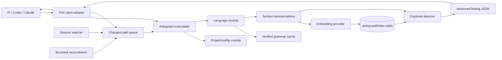

# Antisprawl Architecture

> **Status:** Accepted design, pre-implementation
>
> **Target release:** `0.1.0`
>
> **License:** Apache-2.0

## 1. Purpose

Antisprawl runs reproducible checks after coding-agent edits and surfaces evidence of likely duplicate implementations. It helps an agent discover existing code before adding another utility, helper, or near-copy.

Antisprawl is advisory. It does not prove semantic equivalence, automatically refactor code, or guarantee good architecture.

### Goals

- Detect renamed and near-miss duplication in named functions and methods.
- Prefer precise, actionable findings over broad, noisy recall.
- Check changes incrementally during Pi, Codex CLI, and Claude Code sessions.
- Support multiple source languages without coupling the detector to one syntax tree.
- Support structural-only and configurable remote or local embedding providers.
- Produce the same structural result for the same source, configuration, grammar, and Antisprawl version.
- Fail open when parsing, indexing, watching, storage, or embedding is unavailable.

### Non-goals for v1

- General abstraction-quality or architecture judgment.
- Complexity or erosion enforcement.
- Automatic refactoring.
- Blocking edits or CI.
- Cross-repository indexing.
- Parsing embedded languages inside a host file.
- Approximate nearest-neighbor indexes.
- A public programmatic SDK.
- An MCP server.
- Telemetry.

Cross-language discovery is an opt-in experiment within one project, not part of the primary duplicate detector.

## 2. Terms

| Term                       | Meaning                                                                                                                           |
| -------------------------- | --------------------------------------------------------------------------------------------------------------------------------- |
| **Project**                | The directory containing `.antisprawl/config.json`.                                                                               |
| **Symbol**                 | A named function, method, or named closure/arrow function extracted from a supported grammar.                                     |
| **Probable duplicate**     | A same-language, meaningful-size symbol pair whose semantic and structural evidence passes configured gates.                      |
| **Related implementation** | An opt-in, lower-confidence cross-language match that may reveal duplicated responsibility but cannot usually be reused directly. |
| **Profile**                | The provider, model, dimensions, language, detector version, and thresholds used to interpret embedding similarity.               |
| **Coverage**               | Whether every eligible source file is current in the index. Coverage may be complete, partial, stale, or degraded.                |

## 3. System context



The executable is the only execution interface. Pi, Codex, Claude, skills, and shell hooks do not import Antisprawl internals; they spawn the executable and translate its versioned JSON result.

## 4. External interfaces

### 4.1 Project layout

```text
.antisprawl/
├── config.json       # committed JSONC policy and resolved grammar pins
└── index.sqlite      # disposable, ignored index
```

`init` adds `.antisprawl/index.sqlite*` to the applicable ignore file with confirmation. The glob also excludes SQLite WAL and shared-memory files.

A command finds its root by searching ancestors for `.antisprawl/config.json`. `init` uses its current working directory. Git is optional: when available it accelerates file discovery and reconciliation; otherwise Antisprawl uses configured globs and content hashes.

### 4.2 Public CLI

| Command                                 | Purpose                                                                                                                    |
| --------------------------------------- | -------------------------------------------------------------------------------------------------------------------------- |
| `antisprawl init`                       | Create project configuration, configure a provider or structural-only mode, and establish ignore rules.                    |
| `antisprawl index`                      | Build, resume, reconcile, or replace the project index.                                                                    |
| `antisprawl index --update-grammars`    | Explicitly resolve newer grammar/query pins before indexing.                                                               |
| `antisprawl check [paths...]`           | Update and check named paths; with no paths, reconcile the project.                                                        |
| `antisprawl status [--probe]`           | Report configuration, coverage, grammars, provider, integrations, and recent failures. `--probe` may contact the provider. |
| `antisprawl ignore <id> [--reason ...]` | Add a committed pair-level suppression.                                                                                    |
| `antisprawl ignore --list`              | List suppressions.                                                                                                         |
| `antisprawl ignore --remove <id>`       | Remove a suppression.                                                                                                      |
| `antisprawl report [--json]`            | Produce a local operational report without source or vectors.                                                              |

Harness protocol commands are internal and are not part of the documented user interface.

Machine-readable output is versioned JSON on stdout. Human diagnostics go to stderr. Findings are advisory and therefore exit `0`; malformed invocation, invalid configuration, or failure of an explicitly requested operation exits nonzero. Hook adapters translate failures into each harness protocol and fail open.

There is no public library interface in v1. The CLI JSON protocol is the external seam.

### 4.3 Configuration

`.antisprawl/config.json` accepts JSONC comments and trailing commas. `$schema` is optional. `init` writes `version: 1`; a missing version means v1 with a warning, while an unsupported future version is an error.

Unknown keys produce warnings and are preserved. Wrong value types and contradictory settings are errors. CLI mutations use targeted JSONC edits so comments, formatting, ordering, and unknown keys survive.

Illustrative shape:

```jsonc
{
  "version": 1,
  // "$schema" is optional.
  "embedding": {
    "provider": "openai-codex",
    "model": "text-embedding-3-small",
    "dimensions": 384,
  },
  "sources": {
    "include": ["**/*"],
    "exclude": [],
  },
  "detection": {
    "relatedImplementations": false,
    "maxFindingsPerBatch": 3,
    // minimumTokens and thresholds may override shipped defaults.
  },
  "grammars": {
    // Machine-maintained exact parser/query revisions and asset digests.
  },
  "suppressions": [],
}
```

Provider configuration may name a model, base URL, dimensions, and environment-variable names. API keys and sensitive header values never belong in configuration.

### 4.4 Finding contract

A finding contains:

- protocol version and finding ID;
- finding type;
- edited and candidate symbol names, repository-relative paths, and source ranges;
- language and embedding-profile provenance;
- separate structural and semantic evidence values;
- calibration state when semantic thresholds are custom or unverified;
- concise guidance to inspect whether responsibilities actually match.

The finding does not assert that reuse is mandatory. The agent may reuse the existing symbol, generalize an appropriate shared abstraction, keep an intentional duplicate, or suppress the pair with a reason.

Finding IDs hash the finding type, language, and ordered pair of repository-relative path plus qualified symbol name. Content hashes are tracked separately. A suppression therefore survives edits to the same named pair; moving or renaming a symbol causes reevaluation.

Hooks emit a finding once per agent session and edited-symbol content hash. Manual `check` always returns all current findings. At most three findings are injected per edit batch. Probable duplicates rank ahead of related implementations, and at most one experimental related implementation is injected.

## 5. Modules and seams

Antisprawl uses a few deep modules rather than exposing each implementation detail as an interface.

### Project module

Owns root discovery, JSONC configuration, source inclusion, ignore semantics, path normalization, and configuration invalidation. Callers provide a working directory and receive one validated project description.

### Change-discovery module

Owns session leases, filesystem watching, debouncing, changed-path queuing, and bounded reconciliation. Its output is a set of content-hash-qualified paths; callers do not reason about watcher events.

### Language module

Owns grammar discovery, verified installation, CST parsing, symbol extraction, and primary-language selection. Its adapters normalize grammar-specific captures into one symbol record. Multiple grammar adapters justify this seam.

### Representation module

Converts a symbol into the strict token stream, normalized structural stream, q-gram fingerprints, hashes, and embedding input required by the detector. It is the single source of truth for what a representation version means.

### Embedding module

Owns explicit provider batch limits, input estimation, retries, deadlines, cancellation, credentials, vector dimensions, and content-hash caching. Each bounded chunk calls an Effect `EmbeddingModel` adapter's `embedMany`; Antisprawl does not rely solely on an SDK's implicit batching. OpenAI, OpenAI-compatible, and experimental Codex OAuth implementations are adapters at this seam. Structural-only mode does not instantiate an embedding adapter.

### Index module

Owns SQLite schema, transactions, provenance, file and symbol replacement, vector persistence, queries, partial progress, and atomic rebuilds. It uses the Effect Bun SQLite adapter internally without exposing its generic SQL interface to callers. Storage access remains localized, but v1 does not publish a storage plug-in interface while only one implementation exists.

### Detection module

Owns meaningful-size filtering, candidate retrieval, deterministic structural corroboration, threshold gates, stable ranking, and finding construction. It returns evidence, not refactoring decisions.

### Harness adapters

Translate native session and hook events into CLI invocations, then translate finding JSON into model-visible context. Adapters contain no parsing, indexing, scoring rules, or Effect runtime. They remain minimal native host scripts.

## 6. Effect v4 beta runtime

Effect v4 beta is a required runtime foundation, not an incidental dependency. Effect owns CLI orchestration, configuration decoding, filesystem and provider access, database operations, retries, concurrency, cancellation, scopes, and watcher lifecycle. Parsing, representation, similarity math, and ranking remain ordinary pure TypeScript.

Every directly declared Effect-family package is pinned exactly to `4.0.0-beta.107`, and the lockfile fixes the transitive graph:

| Package                    | Role                                                                |
| -------------------------- | ------------------------------------------------------------------- |
| `effect`                   | Core effects, Schema, Layers, scopes, schedules, and AI interfaces. |
| `@effect/platform-bun`     | Bun platform services and `BunRuntime.runMain`.                     |
| `@effect/sql-sqlite-bun`   | Effect SQL adapter over `bun:sqlite`, including extension loading.  |
| `@effect/ai-openai`        | OpenAI embedding adapter.                                           |
| `@effect/ai-openai-compat` | Generic OpenAI-compatible embedding adapter.                        |
| `@effect/vitest`           | Effect-aware test execution and Layer lifecycle helpers.            |

One `BunRuntime.runMain` entrypoint composes the process Layers. Scopes and finalizers own resources such as SQLite connections, watcher fibers, and signal-driven shutdown. `Schedule`, timeouts, and scoped fibers express retry, deadline, parallelism, and interruption policies instead of custom Promise or `AbortController` machinery.

Effect `Schema` decodes untrusted configuration, CLI protocol data, provider responses, and persisted provenance. Effectful module interfaces return `Effect` with tagged expected errors. Pure modules accept already-decoded values and do not acquire services or add Effect wrappers.

Unstable Effect CLI, AI, and SQL imports stay inside the executable, Embedding module, and Index module implementations respectively. Their types do not cross the external CLI JSON seam or leak into pure detector modules.

Effect's structured logging and metrics feed the approved local diagnostics and bounded counters. No telemetry exporter is configured by default.

Effect-family upgrades are atomic changes that run the full verification suite. Antisprawl `0.1.0` may ship on a verified beta and does not wait for Effect v4 stable.

## 7. Language and grammar architecture

Tree-sitter provides incremental concrete syntax trees, not a language-independent semantic model. Every supported language therefore needs a verified symbol query that maps grammar-specific nodes into the common symbol record.

V1 verifies JavaScript/TypeScript, Python, Go, Rust, and Java. A language is supported only when its parser asset, compatible symbol query, extraction fixtures, and detector fixtures pass acceptance tests. Unknown or ambiguous languages are skipped visibly rather than guessed.

Antisprawl uses the Neovim Tree-sitter registry for language discovery instead of maintaining a competing catalog. On installation it resolves exact parser and query revisions, downloads compatible WASM/query assets, verifies their digests, and records the pins in project configuration. Existing pins never follow `latest`; updates require `antisprawl index --update-grammars`.

Grammar assets are lazily installed into the platform user cache. The cache key includes language, parser/query revisions, runtime/ABI version, and digests. Writes are verified and atomic. The installer treats parser WASM as executable input: sources are restricted, assets are size-bounded and checksum-verified, and parsing is resource-bounded.

Both `index` and `check` may invoke the lazy installer. A hook that cannot finish installation within its deadline fails open; explicit indexing can complete it later.

Only a file's primary language is parsed in v1. Configured path-glob overrides resolve ambiguous extensions. Embedded regions such as JavaScript inside HTML are deferred. Symbols containing Tree-sitter `ERROR` or `MISSING` nodes are skipped, counted in `status`, and retried when their file changes.

Eligible symbols are named functions, methods, and named closures/arrow functions. Enclosing class or module names are metadata, not independently embedded symbols. Whole classes, modules, arbitrary top-level chunks, and anonymous fragments are excluded.

## 8. Representations and detection

### 8.1 Meaningful-size gate

Small getters, wrappers, and validators often become indistinguishable after identifier and literal normalization, yet sharing them would create a worse abstraction. Antisprawl therefore extracts supported symbols but does not embed, compare, or report symbols below `minimumTokens`.

The count uses comment-free canonical tokens so it is deterministic across supported languages. The shipped default is selected from the development corpus rather than guessed in this document. Lowering the threshold requires explicit indexing of newly eligible symbols; raising it only filters existing records.

### 8.2 Two representations

Each eligible symbol produces:

1. **Embedding input:** language, signature, and comment-free body, preserving identifiers and literals.
2. **Structural input:** strict role-aware tokens plus a canonical stream that normalizes local identifiers and literals by category.

The index stores vectors, hashes, token/q-gram fingerprints, metadata, and source ranges. It does not retain raw bodies or embedding inputs.

### 8.3 Detection cascade

For a changed-symbol batch:

1. Parse and represent every eligible changed symbol.
2. Retrieve same-language candidates through embeddings, or through deterministic structural search in structural-only mode.
3. Compare strict and normalized hashes as evidence.
4. Compute exact q-gram overlap and bounded ordered-token overlap.
5. Apply separate meaningful-size, structural, and semantic gates.
6. Rank deterministically and construct findings.

Hash equality is evidence, never an automatic advisory. A normalized equality still requires strict-token or role-aware corroboration. Embedding-enabled near misses must also pass their configured semantic gate. Antisprawl does not collapse evidence into an opaque aggregate score.

Same-language probable duplicates target Type-2 and near-miss Type-3 clones: substantially the same logic with renamed identifiers, changed literals, or small edits. Trivial boilerplate and merely related implementations are excluded.

Cross-language `related_implementation` retrieval is opt-in, embedding-led, lower confidence, restricted to the current project, and unable to displace probable duplicates. It is explicitly experimental.

Threshold defaults are versioned by provider, model, dimensions, language, and detector version. Custom or untested profiles are marked uncalibrated. Semantic findings from such profiles require explicit custom thresholds. Structural findings remain available independently.

Structural results are reproducible from pinned inputs. Remote providers may change a model behind a stable name, so semantic results are reproducible within the persisted vector cache but are not promised to be byte-identical after a clean remote-provider rebuild.

## 9. Embedding providers

V1 supports:

- explicit structural-only operation;
- OpenAI API-key embeddings;
- generic OpenAI-compatible endpoints;
- an experimental Hindsight-compatible `openai-codex` adapter.

There is no implicit provider. `init` requires the user to select a provider or structural-only mode. Any remote provider requires confirmation before source leaves the machine, even when it has no per-call billing.

The normal OpenAI and OpenAI-compatible implementations use `@effect/ai-openai` and `@effect/ai-openai-compat`. Both satisfy Effect's `EmbeddingModel` interface with ordered batch embeddings, explicit dimensions, response validation, configurable base URLs, and usage reporting. The experimental Codex OAuth provider is a custom adapter to that same interface so its file-backed authentication and refresh behavior remain localized. Other named providers can be added later without changing the CLI protocol.

### Experimental Codex OAuth adapter

The vertical slice uses `openai-codex/text-embedding-3-small`, following Hindsight's tested behavior:

- read `$CODEX_HOME/auth.json`, falling back to `~/.codex/auth.json`;
- require file-backed ChatGPT/Codex authentication;
- send the access token as a bearer token to `https://api.openai.com/v1/embeddings`;
- lock the auth file, refresh shortly before expiry, retry once after `401`, preserve unknown fields, and atomically write rotated tokens;
- never log or expose tokens;
- fail open without modifying the file when refresh fails.

This route is supported by Hindsight but is not guaranteed by OpenAI's public API contract. It is therefore experimental and intended initially for personal development. Keyring-only credentials are unsupported until a documented bridge exists.

The vertical slice starts at 384 dimensions and compares it with 1536 dimensions on the same fixtures before a shipped profile is chosen.

Full indexing first discovers symbols and estimates input. A TTY shows the provider, model, dimensions, source-egress status, and estimated input before confirmation. Non-interactive remote indexing requires `--yes`; `--dry-run` performs no embedding calls. Hooks never start a full or newly billable backfill.

## 10. Persistence and vector search

The disposable project index lives at `.antisprawl/index.sqlite`. It stores:

- schema and representation provenance;
- project and coverage state;
- files, content hashes, languages, and parse status;
- symbol identities, qualified names, ranges, token counts, and fingerprints;
- embedding profile metadata and vector BLOBs;
- durable changed-path queue and watcher leases;
- session finding-deduplication state;
- aggregate operational counters and bounded sanitized recent failures.

It stores no source, prompts, commands, transcripts, or credentials.

`@effect/sql-sqlite-bun` is the Index module's internal Effect adapter over the underlying `bun:sqlite` persistence implementation. Its `loadExtension` support loads target-specific SQLite-Vector libraries after each library is embedded in the release executable, checksum-verified, and extracted once into a private versioned cache. The adapter's generic `SqlClient` does not cross the Index module's interface; a custom direct wrapper is justified only if acceptance tests reveal a required transaction or SQLite-Vector operation the adapter cannot express. Initial search uses deterministic `vector_full_scan`. A pure-Bun exact cosine scan over ordinary vector BLOBs is the guaranteed fallback when extension extraction or loading is unsupported.

Quantized search requires recall benchmarks before enablement. ANN indexes are a v1 non-goal. LanceDB, USearch, and alternate storage engines are deferred until measured scale requires them.

An interrupted full index commits completed provider batches and resumes by content hash. Coverage remains partial until reconciliation completes; partial results may still yield advisories, while `status` reports incomplete coverage.

A configuration or schema incompatibility never triggers a surprise rebuild from a hook. The index becomes stale, and one diagnostic per session asks for an explicit `antisprawl index`. Rebuilding writes a replacement database and atomically swaps it into place only after completion.

## 11. Incremental operation and concurrency

A changed-file batch follows this order:

1. Read and hash every changed file.
2. Parse and represent all changed symbols.
3. Obtain missing embeddings outside any SQLite write transaction.
4. Re-read hashes; discard work for files that changed during processing.
5. In short transactions, replace all affected file/symbol records as one batch.
6. Query every changed symbol against the now-current index, including other symbols from the same parallel edit batch.

Concurrent hook processes use SQLite locking with a busy timeout bounded by the hook deadline. Lock contention, provider timeout, or a stale file fails open. No hook delays the agent indefinitely.

The initial hook deadline is five seconds and remains configurable. Explicit `index` and reconciliation operations have separate longer budgets. Effect timeouts, schedules, and scoped fibers enforce these budgets, provider retry policies, and embedding parallelism. Interruption runs registered finalizers before process exit.

## 12. Watchers and reconciliation

One watcher runs per project. Agent sessions attach leases; the watcher exits after the final lease disappears or an idle timeout expires. It ignores `.antisprawl/`, configured exclusions, and its own cache paths.

Watcher events are lossy hints, not the source of truth. The watcher debounces atomic-save bursts and queues paths but does not call the embedding provider. Structured edit hooks enqueue exact paths as a fast path. The adapter flushes queued paths at its strongest available pre-model boundary.

Bounded reconciliation runs at session start, turn end, and periodically during long sessions. It compares actual eligible files with stored content hashes and catches coalesced or dropped watcher events. If reconciliation cannot finish within its budget, Antisprawl continues with degraded coverage and reports that state.

The cross-harness watcher design is documentation/source-backed and must be runtime-tested:

- **Pi:** start and stop through session lifecycle events; flush through the awaited context hook before model requests.
- **Claude Code:** native file-change facilities may feed the queue; synchronous `PostToolBatch` is the strongest flush point before the next model call.
- **Codex CLI:** a detached helper starts from session lifecycle hooks; `PostToolUse` is only an after-tool flush point, not a universal before-every-model hook.

Detached shutdown is best-effort. Stale PID/lease cleanup, idle expiry, and reconciliation recover from abandoned watchers.

## 13. Configuration invalidation

| Change                                                   | Required work                                      |
| -------------------------------------------------------- | -------------------------------------------------- |
| Suppressions or advisory limits                          | None.                                              |
| Ordinary scoring thresholds                              | Rescore only.                                      |
| Raise `minimumTokens`                                    | Filter existing entries.                           |
| Lower `minimumTokens`                                    | Explicitly index and embed newly eligible symbols. |
| Include/exclude rules                                    | Reconcile affected files.                          |
| Grammar or parser representation                         | Rebuild affected languages.                        |
| Provider, model, dimensions, or embedding representation | Rebuild vectors.                                   |
| Incompatible index schema                                | Build and atomically swap a new index.             |

Hooks may report required work but never initiate billable backfills or full rebuilds.

## 14. Failure, privacy, and trust model

Antisprawl is a quality assistant, not an anti-tampering control. An agent with shell access can edit configuration, delete the index, or bypass hooks. Antisprawl records and reports provenance changes but does not claim to resist an adversarial agent. CI enforcement is separate future work.

Operational rules:

- All advisory subsystems fail open.
- Diagnostics are concise and deduplicated per session.
- Uninitialized, stale, or incompatible indexes produce one instruction to run `antisprawl index`.
- Parser errors reduce coverage instead of generating speculative findings.
- Paths are normalized relative to the project; source discovery never follows symlinks outside it.
- Provider secrets are read only from named environment variables or the experimental Codex auth file.
- Remote source egress is explicit.
- There is no telemetry by default.

`report` retains only aggregate counts, current finding state, session deduplication state, estimated provider usage, and a small bounded list of sanitized failures. Observable warning outcomes are limited to:

- `resolved`: the pair no longer triggers;
- `suppressed`: the finding was ignored explicitly;
- `persisting`: the pair still triggers;
- `unknown`: parsing or coverage is insufficient.

Antisprawl never claims that an agent complied or reused code without deterministic evidence.

## 15. Agent packaging and skills

The repository contains an Agent Plugins v1 manifest for portable identity and skills. Agent Plugins v1 does not standardize hooks, commands, installation, or permissions, so native overlays remain necessary:

- Codex uses `extensions.com.openai` hook declarations.
- Claude uses its native plugin manifest and hook configuration.
- Pi uses its package manifest and an extension that shells out with `child_process`.

The client overlays remain Effect-free and communicate only through the compiled executable's JSON protocol. Plugin manifests own hook registration. `antisprawl init` does not rewrite a supported client's settings when its plugin is installed; it prints manual instructions when no supported plugin is detected.

The plugin and executable are separate installable concerns. Hooks call `antisprawl` from `PATH` and never download an executable during an edit. Two model-invoked skills accompany the CLI:

- **`antisprawl-install`:** install, initialize, configure, upgrade, and troubleshoot Antisprawl.
- **`antisprawl`:** run the CLI, interpret findings, inspect status, and manage intentional suppressions.

The skills contain workflow and non-obvious decision rules. CLI `--help` and the configuration schema remain the single sources of truth for commands and fields.

No MCP server is included in v1 because it would duplicate the CLI without providing portable post-edit hooks.

## 16. Build and distribution

Antisprawl is implemented in TypeScript on Effect `4.0.0-beta.107` and built with a pinned Bun toolchain. The process enters through `BunRuntime.runMain` from the matching `@effect/platform-bun` package. `bun build --compile` produces one executable per operating-system/architecture target; there is no universal binary. Harnesses spawn the executable and never import Bun- or Effect-specific code.

Initial release targets are:

- Linux x64 and arm64;
- macOS x64 and arm64;
- Windows x64.

Musl and Windows ARM64 follow only after CI verifies the complete parser, database, provider, and fallback path.

GitHub Releases publish checksummed standalone executables. npm provides a convenience launcher with platform-specific optional binary packages. Direct-download users require neither Node nor Bun at runtime. The executable never self-updates.

Grammar assets may be installed lazily, but pinned project assets do not update automatically. Binary and grammar provenance is visible through `status`.

## 17. Verification strategy

Vitest is pinned to `4.1.11`, with `@effect/vitest@4.0.0-beta.107`. Effectful module tests use `it.effect`, `it.layer`, `TestClock`, and scoped fixtures. Pure parser, fingerprinting, similarity, and ranking tests remain ordinary synchronous Vitest tests.

There is no numeric public precision claim. Precision, recall, warning frequency, latency, failures, and provider usage are regression signals.

### Detector evaluation

Maintain a public development and frozen test corpus grouped by repository and clone family. Include:

- project-authored real Type-2 and near-miss Type-3 pairs;
- deterministic mutation/injection variants;
- hard negatives with similar syntax but different responsibilities;
- wrappers, getters, validators, and boilerplate that must not produce advisories.

Only project-authored or clearly Apache-compatible fixtures are committed. License-sensitive corpora such as BigCloneBench or Stack Overflow-derived datasets remain external through optional tooling.

### Trajectory evaluation

Use paired long-running agent tasks that preserve the agent's own workspace across checkpoints. Measure correctness and regressions first, then introduced duplication, findings shown, observable outcomes, latency, failures, and provider usage. SCBench is a useful runner/reference, not detector ground truth.

### Required acceptance tests

- Every verified language's extraction and error handling.
- Structural-only and each shipped provider profile.
- 384- versus 1536-dimensional vertical-slice comparison.
- Compiled Bun execution on every target through `BunRuntime.runMain`.
- Exact Effect-family version alignment and composed Layer startup/shutdown.
- Effect interruption, timeout, retry, scoped-resource, and tagged-error behavior.
- Embedded `web-tree-sitter` runtime and lazy grammar WASM loading.
- `@effect/sql-sqlite-bun` transactions, SQLite-Vector extraction/loading, and pure-Bun fallback.
- Effect AI OpenAI/compatible batching, dimensions, response validation, and usage reporting.
- Pi, Claude, and Codex lifecycle, watcher, flush, and advisory delivery.
- Interrupted indexing, concurrent hooks, stale leases, and atomic rebuilds.
- JSON protocol and JSONC-preserving configuration edits.

## 18. Delivery sequence

### Vertical slice

Build only enough to validate the core signal:

- Bun CLI built with `effect/unstable/cli` and `BunRuntime.runMain`;
- TypeScript symbol extraction;
- experimental Codex OAuth as an Effect `EmbeddingModel` adapter with `text-embedding-3-small`;
- `@effect/sql-sqlite-bun` persistence and exact vector scan;
- manual `index` and `check`;
- authored clone and hard-negative fixtures;
- dogfooding against Antisprawl's own TypeScript source.

Continue only when the slice detects authored renamed/near-miss clones, rejects wrapper/boilerplate negatives, replaces edited-file symbols incrementally, resumes interrupted indexing, and emits stable actionable JSON.

### v0.1.0

Add:

- five verified languages;
- OpenAI API-key and generic OpenAI-compatible providers;
- SQLite-Vector with exact fallback;
- project watcher and reconciliation;
- Pi, Codex, and Claude integrations;
- Agent Plugin and both skills;
- supported release binaries and reports.

The repository remains one package with ordinary `src/`, `tests/`, `skills/`, and client-overlay directories. Platform npm packages are generated during release rather than maintained as a source monorepo.

## 19. Empirical parameters

The architecture deliberately does not fix values that must come from evidence:

- `minimumTokens`;
- structural and semantic thresholds;
- embedding candidate count;
- 384 versus 1536 dimensions;
- watcher debounce and reconciliation intervals;
- SQLite-Vector target support;
- whether quantized search preserves adequate recall.

These values are versioned once selected and remain visible in configuration or index provenance.

## References

- [Measuring code sloppiness](https://earendil.com/posts/measuring-code-sloppiness/)
- [SlopCodeBench](https://www.scbench.ai/)
- [Tree-sitter documentation](https://tree-sitter.github.io/tree-sitter/)
- [Neovim Tree-sitter parser registry](https://github.com/neovim-treesitter/treesitter-parser-registry)
- [Agent Plugins specification](https://agent-plugins.org/specification)
- [Codex hooks](https://developers.openai.com/codex/hooks)
- [Claude Code hooks](https://code.claude.com/docs/en/hooks)
- [Effect documentation](https://effect.website/docs/)
- [Effect repository](https://github.com/Effect-TS/effect)
- [Bun standalone executables](https://bun.sh/docs/bundler/executables)
- [Bun SQLite](https://bun.sh/docs/runtime/sqlite)
- [SQLite-Vector](https://github.com/sqliteai/sqlite-vector)
